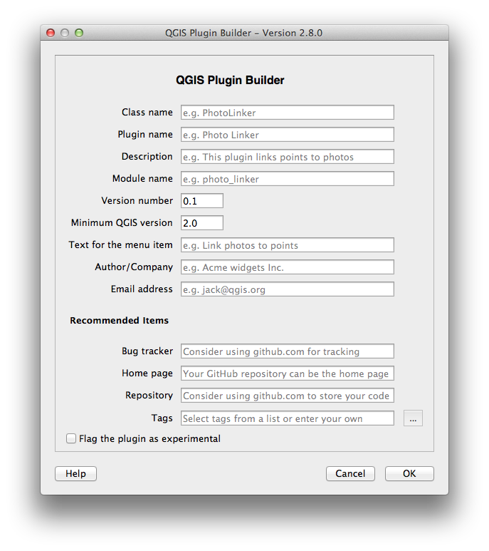
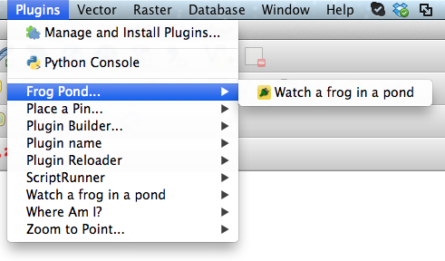
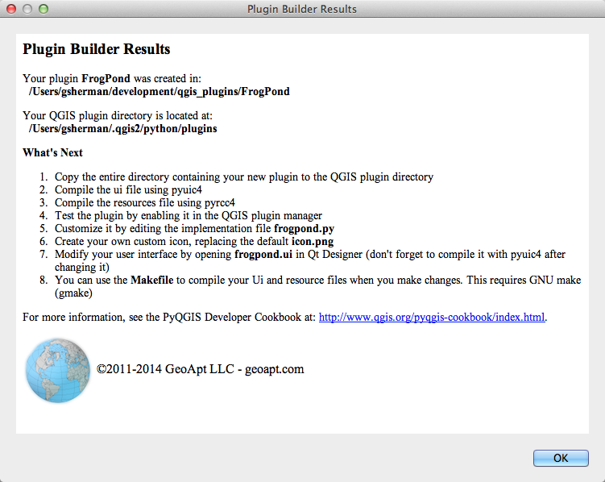
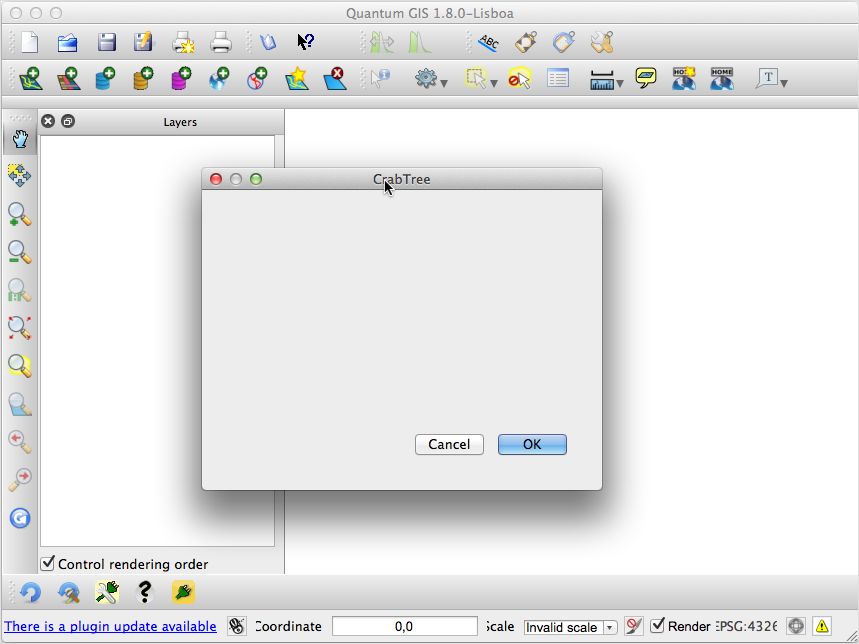

.. QGIS Plugin Builder documentation master file, created by
   sphinx-quickstart on Sat Jan  5 14:17:19 2013.
   You can adapt this file completely to your liking, but it should at least
   contain the root `toctree` directive.

QGIS Plugin Builder
===============================================

.. toctree::
   :maxdepth: 2

.. index:: Concepts

Concepts
=================

Plugin Builder provides you a working template from which you can create
your own plugin.

The steps to using Plugin Builder are fairly simple:

#. Open the Plugin Builder from within QGIS
#. Fill out the required information
#. Click OK
#. Designate where to store your new plugin
#. Compile your resource  file
#. Install the plugin
#. Test it

.. index:: Plugins; creating

Running Plugin Builder
======================

When you run Plugin Builder you will see a dialog with text fields. Each text
field contains a hint inside it in greyed out text that will disappear when
you start typing text into it. There is also a tooltip containing help
information that will appear when you hover over each text field:

The descriptions give you a hint about what is required for each field. The
following sections describe the required and optional parameters in greater
detail.

.. index:: parameters; required

Required Parameters
...................

:Class name: This is the name that will be used to create the Python class for
your plugin. The name should be in CamelCase with no spaces. Plugin Builder
will accept an all lower case class name but this should be avoided since it
isn't in line with Python coding style. Examples of valid class names are:

* MyPlugin
* PluginBuilder
* ScriptRunner

:Module name: This is the name that will be used to create the Python module (
file) for your plugin. The name should be in lowercase with words separated
using underscores. Plugin Builder will accept any case module name but
this should be avoided since it isn't in line with Python coding style.
Examples of valid module names are:

* detect_features
* detector

:Plugin name: This is a title for your plugin and will be displayed in the
QGIS plugin manager and the plugin installer. It will also be used as the
menu name that appears in the QGIS Plugin menu. You can use the Class name,
or make it more readable. Some examples:

* My Plugin
* Plugin Builder
* ScriptRunner

:Description: This is a one line description of the plugin's function and is
displayed in both the Plugin Manager and Plugin Installer. Keep it short
yet descriptive so the purpose of the plugin can be easily determined.

:Version number: This is the version number of your plugin. Plugin Builder
suggests 0.1, but you can start with any number. The Plugin Installer uses the
version number to identify which plugins you have installed are upgradeable so
it is important to increment it as you release new versions.

:Minimum QGIS version: This is the minimum version of QGIS required for your
plugin to work. If your plugin uses features only present in a newer version,
be sure to set this field accordingly to prevent problems for those running
older versions. Version 2.0 of Plugin Builder defaults this field to 2.0.

:Text for the menu item: This is the text that will appear in the menu.
In the example below, the plugin name is Frog Pond and the text for the menu
item is displayed to the right of it:

In general you shouldn't use the same text for the plugin name and the menu
item; if you do your menu will look like this:

.. image:: images/redundant_menu.png
   :align: center

:Author/Company: Put your name or company name here---this information is used
in writing the copyright statement in the source files of your plugin, as well
as being displayed in the Plugin Installer and on the
`QGIS plugin repository <http://plugins.qgis.org/plugins>`_.

:Email address: Put an address where users of your plugin can contact you.
This information is written to the copyright header of your source files and
also displayed on the QGIS plugin repository listing for your plugin.

.. index:: parameters; optional

Optional Parameters
...................

There are several optional but highly recommended fields that you should
consider completing when generating a new plugin.

:Bug tracker: A URL pointing to the bug/issue tracker for your plugin. You can
create a project with tracking for your plugin(s) at
http://hub.qgis.org/projects/new or of course you can use http://github.com.

:Home page: The URL of the home page for your plugin. This can be the same as
the project page you create on hub.qgis.org or a site of your own.

:Repository: The URL of the source code repository for your plugin. This
allows others submit patches and improvements for your approval, as well as
providing you with the benefit of source code control.

:Tags: Tags are a comma separated list of keywords describing the function(s)
of your plugin.

:Experimental: Check this box if your plugin is considered experimental,
meaning it is either incomplete or may cause unintended consequences. This
allows users to filter out experimental plugins in the Plugin Installer if
they choose not to live on the bleeding edge.

Results
=======

When you click OK, Plugin Builder creates your new plugin for you and
displays the results:

The results dialog tells you where your plugin was saved, the location of your
QGIS plugin directory, and what to do next. This same information is contained
in the ``README.html`` and ``README.html`` files in your generated plugin
directory.

.. index:: compiling

.. index:: Plugins; compiling

Compiling the resource file
===========================

After you generate your plugin the resource file needs to be compiled before
it is functional in QGIS.

.. index:: resource file
   double: compiling; resource file

The resource file contains definitions of media used in your plugin. Upon
generation, this contains one entry for icon.png, the icon file for the plugin.

To compile the resource file into Python code, use the ``pyrcc4`` utility
that comes as part of your PyQt installation::

  pyrcc4 -o resources.py resources.qrc

Once the resource file is compiled, the generated plugin can be loaded in QGIS.

.. index:: deploying

.. index:: Plugins; deploying

Deploying
=====================

To deploy your new plugin during development, you have two choices:

#. Copy the entire plugin directory to your QGIS plugins directory
#. Use the ``QGIS_PLUGINPATH`` environment variable to point to the directory
where your development plugin(s) are located

.. index:: deploying; copy method

The Copy Method
................

To deploy in this fashion, simply copy your plugin directory to the location
of your QGIS plugins. By platform, this location is:

* Linux: ``.qgis2/python/plugins`` in your home directory, typically found at
    ``/home/gsherman/.qgis2/python/plugins``

* Mac OS X: ``.qgis2/python/plugins`` in your home directory, typically
      ``/Users/gsherman/.qgis2/python/plugins``

* Windows: ``%HOMEPATH%\.qgis2\python\plugins``, by default,
       ``C:\Documents and Settings\gsherman\.qgis2\python\plugins``

Since each plugin must be contained in its own subdirectory in
``.qgis2/python/plugins``, make sure you copy the directory, not the files in
the directory.

If your operating system supports gmake (GNU make), you can use the deploy
target of the Makefile in your plugin directory to deploy directly to
``.qgis2/python/plugins``::

  make deploy

.. index:: deploying; environment variable method
.. index:: QGIS_PLUGINPATH

The Environment Variable Method
................................

Using the ``QGIS_PLUGINPATH`` environment variable you can tell QGIS to look
in an additional location for plugins. This can be handy for development,
allowing you to test your plugin without copying it to
``.qgis2/python/plugins``.

To use this method, set the ``QGIS_PLUGINPATH`` environment variable to point
to your development directory before starting QGIS. When QGIS starts up, all
the directories in ``QGIS_PLUGINPATH`` will be searched and those
containing valid plugins will be added to the Plugin Manager.

.. index:: testing
.. index:: Plugins; testing

Testing
=====================
With your new plugin deployed, start up QGIS, open the Plugin Manager, and
enable it. Then click on the tool or the menu item for the plugin to run it.
If all is well, you should see something similar to this:

If the plugin throws an error make sure you have compiled the resource file
before deploying and testing.

Once the generated plugin is working it's your turn to customize the user
interface and add the needed code to make it do something useful.

.. index:: Makefile
   double: Makefile; using

Using the Makefile
==================
The make file can be used to compile and deploy your plugin, assuming you are
using an operating environment that supports
`GNU make <http://gnu.org/software/make>`_. It also provides a number of other
actions to aid in plugin development.

.. index:: targets
   double: Makefile; targets

The following targets are supported

:clean: Delete the compiled UI and resource files
:compile: Compile the resource and UI files. This is the default target.
:dclean: Same as ``derase`` but also removes any .svn entries
:deploy: Deploy the plugin
:derase: Remove the deployed plugin
:doc: Build the documentation using Sphinx
:package: Package the plugin using git archive
:transclean: Delete all .qm (translation) files
:transcompile: Compile translation files into .qm format
:transup: Update the .ts (translation) files
:upload: Upload the plugin to the QGIS repository
:zip: Deploy the plugin and create a zip file suitable for uploading to the
    QGIS repository
:test: Run unit tests and produce a coverage report.
:pep8: Run python PEP8 check and produce a report.
:pylint: Run python pylint check and produce a report listing any violations.

.. index:: documentation
.. index:: Plugin; documenting

Documenting your Plugin
=======================

.. index:: Sphinx

Plugin Builder creates a `Sphinx <http://sphinx-doc.org>`_ project for you in
the ``help`` subdirectory of your plugin. To build the documentation you will
need to install Sphinx using `pip <http://pypi.python.org/pypi/pip>`_
or `easy_install <http://peak.telecommunity.com/DevCenter/EasyInstall>`_.
Once installed, you can build the documentation using ``make doc``
or change to the ``help`` subdirectory and use ``make html``
(this works on any platform).

Sphinx supports building other formats, including latex, text, qthelp, and epub.

Of course you need to actually *write* something to document your plugin by
editing ``help/source/index.rst``.

Once your documentation is complete you can distribute it with your plugin,
as well as publishing it on a website. You can also add a Help button to the
button box group on the dialog and connect it to a method to show your help
file in the user's default web browser. See the code in ``pluginbuilder.py``
for an example.

For an example of writing your documentation using Sphinx, you can
`view <_sources/index.txt>`_ the source of this document.

.. index:: repository
.. index:: Plugins; repository

The Repository
============================
When your plugin is ready to be shared with the QGIS community, upload it to
the QGIS plugin repository at http://plugins.qgis.org/plugins. Make sure to
package it properly in zip format and test the zip before adding it to the
repository.

When you add it to the repository, your plugin will show up in the Plugin
Installer in QGIS, making it available for download and install by the
community.

.. Indices and tables
======================

.. * :ref:`genindex`

.. * :ref:`modindex`

.. * :ref:`search`

